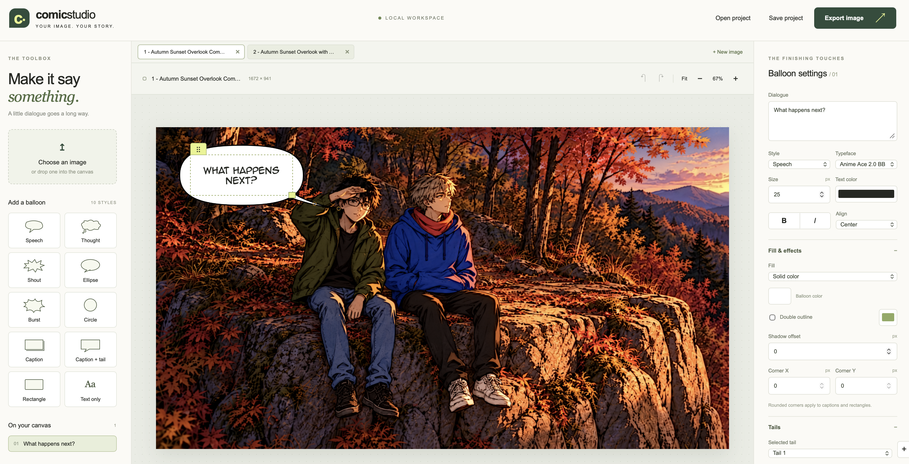

# Comic Studio

A local image editor powered directly by the [Comical JS](https://github.com/BloomBooks/comical-js) Git submodule. Choose an image, add and edit comic balloons, and export the finished image at its original resolution. Images and projects stay in the browser; the Node server only serves static application files.



## Run locally

Install Node.js 22 or newer, then:

```sh
git clone https://github.com/cekkr/comic-studio.git --recurse-submodules
cd comic-studio
# or normal clone and then
git submodule update --init --recursive

npm install
npm start
```

Open **http://127.0.0.1:3000**. The server builds the browser bundle on startup and listens only on localhost. To use a different port:

```sh
PORT=3001 npm start
```

For a fresh checkout, clone with `git clone --recurse-submodules <repository-url>`. The included `pnpm-lock.yaml` also supports `pnpm install` and `pnpm start`. Development changes take effect after restarting the server. `npm run build` builds the client without starting the server.

## Editing

- Choose or drop PNG, JPEG, WebP, GIF, AVIF, or BMP images. Each image opens in its own editor tab; multiple files can be selected together. **+ New image** opens another image without replacing existing work. Click a tab to return to it, or its × button to close only that canvas. The sample canvas provides a quick way to try the editor.
- Click a style in the toolbox to add a balloon. Drag the text or the green grip to move it; drag the corner handle to resize.
- New balloons inherit the last selected balloon's typeface, size, text color, alignment, bold, and italic settings. These text defaults are remembered in local storage across image changes and page reloads. The chosen toolbox style still determines the new balloon shape. With no remembered settings, the initial font size adapts to the image width; if an imported font is no longer available, the Comic typeface is used.
- Edit dialogue in the right panel, or double-click it on the canvas. Escape or clicking outside finishes inline editing. Text that exceeds the content box is clipped: enlarge the box or reduce the font size to fit it.
- Select a balloon, then drag its orange tail handles. The panel also provides precise tip and curve coordinates, automatic/manual curvature, and up to eight tails.
- Use Fit and the zoom buttons to navigate. Each image tab keeps its own zoom, selection, edits, and undo history. Arrow keys move the selected balloon; Shift moves it by ten pixels. Delete/Backspace removes it. Ctrl/⌘ Z and Ctrl/⌘ Shift Z undo/redo, with up to 50 history steps per tab during the current session.
- Open canvases are automatically saved in browser IndexedDB and restored after a reload, including the active tab, text, balloons, and zoom. Closing an editor tab removes it from this saved workspace. Undo history starts fresh after a browser reload. Browser storage is specific to this local site's address; clearing that storage removes its saved workspace.
- **Save project** downloads the active tab as a `.comic.json` file containing its original image, text, position, formatting, and Comical specifications. **Open project** restores it in a new editor tab. Keep downloaded projects as portable copies, especially before closing a canvas or clearing browser storage.
- **Export image** asks you to choose both contents and file format every time: **Complete image + balloons**, or **Balloons only**, and PNG, JPEG, or WebP. WebP is disabled in browsers that cannot encode it. Exactly one file downloads at the original image dimensions. Complete export decodes and draws the original image directly before compositing the balloon layer, including on the first download. Editing handles are excluded; the live canvas stays editable. PNG and WebP preserve transparency; balloon-only exports have a transparent background. JPEG uses white for transparent areas. Animated inputs export their rendered frame as a still image.

## Styles and effects

The palette exposes all implemented Comical styles: speech, thought, shout, ellipse, pointed arcs (Burst), circle, caption, caption with a tail, rectangle, and text only.

Available settings include solid/transparent fill, vertical gradients with up to eight colors, a colored double outline, shadow offset, corner X/Y radii for rectangular styles, and tail coordinates and automatic curvature. Typography controls include five font families, size, color, bold, italic, and alignment.

### Anime Ace 2.0 BB

Select **Anime Ace 2.0 BB** in the Typeface menu. Its regular, bold, and italic TTF files are included under `public/fonts/anime-ace`, together with the author's original `font info.txt` usage terms. The editor uses these project files without requiring a Downloads folder or system font installation. The combined bold/italic setting uses browser synthesis. Image export embeds the font while rendering, preserving the lettering in the resulting raster image. Projects retain the typeface selection.

### Import more fonts

Create a family folder inside **`public/fonts`**, add its TTF/OTF/WOFF/WOFF2 files and usage terms, and describe the faces in `font.json`. Refresh the editor to discover the family automatically; no source-code changes or server restart are needed. See [`public/fonts/README.md`](public/fonts/README.md) for the manifest format and a complete example. Save your project before refreshing. When sharing a saved project that uses an imported family, include its font folder in the receiving editor too.

**Position & connections** exposes family/layer and order. Connect a balloon to its predecessor to create a linked family, or make it independent. Family members share the first balloon's appearance; overlapping shapes merge. Comical renders shape layers beneath the HTML text. `borderStyle` and independent tail `style` fields are documented upstream as unimplemented, so the editor does not expose them as working effects. Comical fixes the main outline to black and sets its thickness by shape.

Limits: 100 balloons per canvas, 30 MB input image, 8192 pixels per side, 32 megapixels, and 50 MB project files. Local font availability determines the Comic typeface (Comic Sans/Chalkboard with a cursive fallback).

## Implementation and checks

`server.mjs` is a small Node HTTP server with no upload or write endpoints. `scripts/build.mjs` bundles `src/app.ts` and `vendor/comical-js/src/index.ts` with esbuild; the submodule source is used directly, without installing its Storybook or older webpack development stack. Paper.js matches the version requested by the submodule. Export uses Comical's non-destructive SVG export and html-to-image for the balloon/text layer, then composites the decoded original image with the Canvas API. `src/workspace.mjs` stores open tabs in IndexedDB; text preferences remain in local storage.

```sh
npx playwright install chromium
npm test
```

Tests cover project validation and history, static server boundaries, all balloon styles, movement/resizing, tail dragging, inline text, undo/redo, family deletion, project round trips, and original-resolution PNG/JPEG/WebP exports including transparency and image/balloon pixel checks. Chromium is the tested browser.
Additional browser checks cover the first download, transparent balloon-only export, independent image tabs, closing tabs, and IndexedDB recovery. To check export and tab recovery in WebKit too:

```sh
npx playwright install webkit
npm run test:webkit
```

The application is covered by the repository's GPL license. Comical JS retains its own MIT license in the submodule. Font assets retain their authors' separate terms, included alongside the files.
